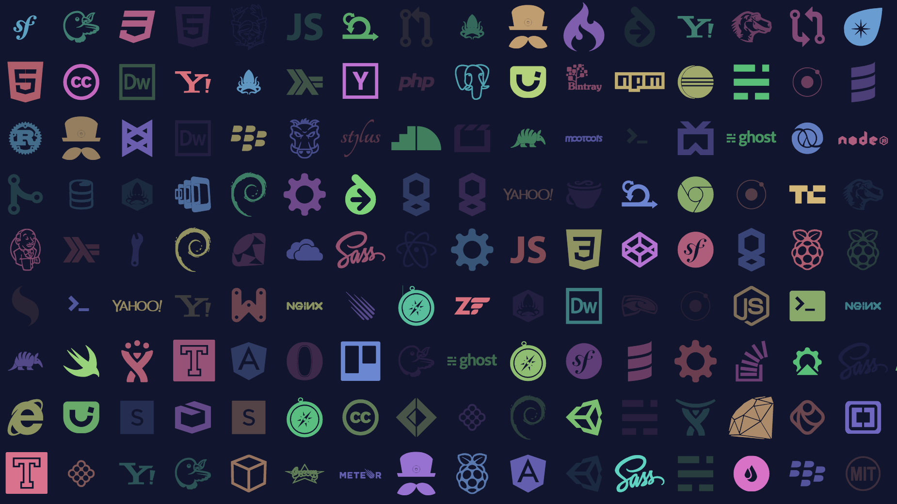

## css-doodle-play    

<p align="center">
  <a target="_blank" href="https://github.com/WeiChiaChang/css-doodle-play">
    
  </a>
</p>
<p align=center>
  <a target="_blank" href="https://opensource.org/licenses/MIT" title="License: MIT"></a>
  <a target="_blank" href="http://makeapullrequest.com" title="PRs Welcome"></a>
</p>

> Play Web Components with [css-doodle](https://github.com/css-doodle/css-doodle).


## 😃 Demo
Here's the [demo url](https://weichiachang.github.io/css-doodle-play/) which deployed on github pages.

## 💡 Idea

The idea comes from [file-icons-js](https://www.npmjs.com/package/file-icons-js), simply just out of interest and try to generate similar images by code 🐻.

## 💻 Develop
```shell
# install dependencies
$ npm install

# serve with hot reload at localhost:8080
$ npm run dev

# build for production with minification
$ npm run build
```

## 📚 Related Resources
- [css-doodle](https://github.com/css-doodle/css-doodle)
- [vue-integrate-web-components/](https://alligator.io/vuejs/vue-integrate-web-components/)

## 💉 Donate

<a href="https://www.buymeacoffee.com/dKPhu3g" target="_blank"></a>

## ©️ License
MIT © [WeiChiaChang](https://github.com/WeiChiaChang)


